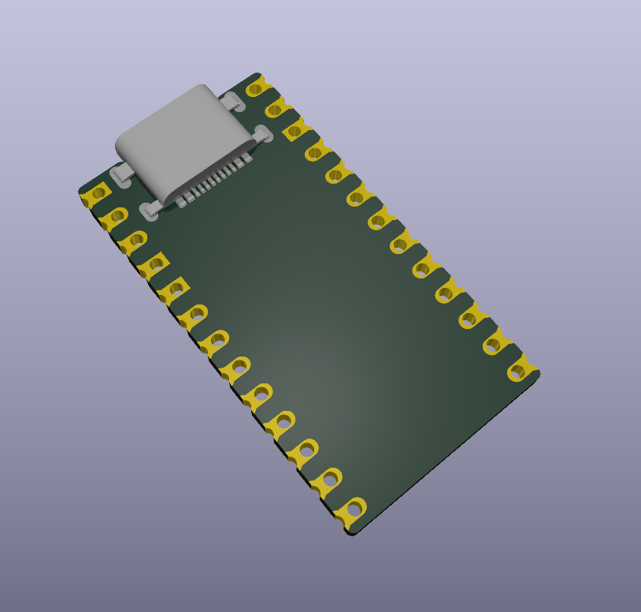

# Thing Plus/Feather Project Template

  

This KiCAD Template simplifies initial setup for Thing Plus or Feather PCB designs.

To begin, clone this repository to your KICAD_USER_TEMPLATE_DIR as found under "Preferences > Configure Paths..."

Next, use "File > New Project from Template..." or "Ctrl+T" and select "User Templates." Select the template and begin!
